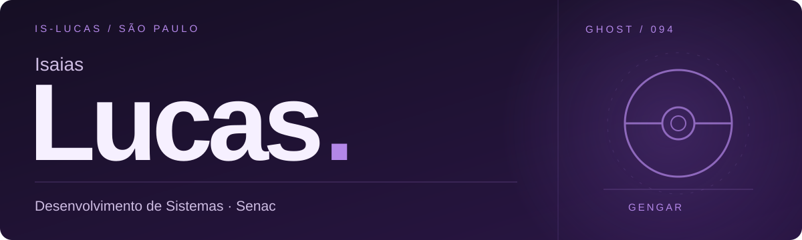

  

Estudo **Desenvolvimento de Sistemas no Senac** e tenho experiência com suporte técnico e infraestrutura de TI. Por aqui, estou construindo meu caminho na programação e compartilhando o que aprendo.

 

| Já trabalhei com | Estou estudando |
| :--- | :--- |
| Suporte a usuários e Windows | HTML · CSS · JavaScript |
| Redes, cabeamento e organização de racks | React · SQL |

 

### Estudos & projetos

Os projetos e exercícios ficam nos [meus repositórios](https://github.com/Is-Lucas?tab=repositories). É onde vou colocando em prática o que estudo.

 

Isaias Silva · São Paulo, Brasil
